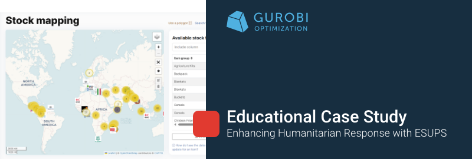

(intro)=

# Welcome to the ESUPS Educational Case Study



Enhancing Humanitarian Response with ESUPS and the STOCKHOLM Platform 

In this comprehensive case study, learners students will delve into the strategic and operational efforts of the Emergency Supply Pre-positioning Strategy (ESUPS), a collaborative working group consisting of Member States, NGOs, academics, UN agencies, and regional organizations, all operating within Welthungerhilfe, one of the largest private aid agencies in Germany. ESUPS plays a critical role in logistics preparedness and pre-positioning at both strategic and operational levels, aiming to optimize the pre-positioning of disaster relief items, minimize relief response times, and enhance the mapping and analysis of relief stock across global humanitarian organizations.

```{tableofcontents}
```

## Acknowledgements 
Ben Rapkin, Florent Chane, Jason Acimovic, Lindsay Montanari, Jerry Yurchisin, Mario Ruthmair, Ronald van der Velden, Andrew Antenucci, Ben Kennerly