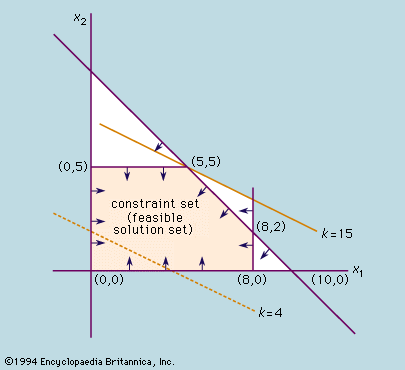

# Optimization: A Structured Approach

It’s clear that the sheer size of possible allocations makes a purely machine learning approach inefficient for this problem. Neural networks, while powerful, rely on sampling from a solution space that is inconceivably large, then gradually improving through incremental updates. This approach can be highly ineffective when dealing with a combinatorial explosion of possibilities, as we saw with our earlier calculations.

Instead, when faced with such a **well-defined** problem—where we know the objective function, inputs, outputs, and constraints—a more **structured** approach through optimization becomes not only viable, but advantageous. Optimization techniques are specifically designed to handle these kinds of problems efficiently by applying systematic mathematical logic, rather than heuristic sampling.

In this case, our problem is clearly formulated:

**Decision Variables** (the decsions we can control):

- The amount of supplies to allocate to, and send from, a warehouse.

**Objective Function** (what we want to minimize or maximize):

-	Minimize the travel time or cost required to meet demand by pre-positioning supplies.

**Constraints** (how we can change the variables): 

-	Ensure demand is met without exceeding available supplies.

Unlike neural networks, optimization frameworks don’t blindly sample solutions from a vast space. Instead, they apply logical methods to systematically explore and reduce the search space, ultimately providing a set of potential optimal solutions. This not only increases efficiency, but also provides clarity and insight into why a particular solution is optimal, which is invaluable for decision-making and explanation.

## The Simplex Method

The simplex method is a powerful algorithm for solving [linear programming](https://en.wikipedia.org/wiki/Linear_programming) problems, which involve optimizing a linear objective function subject to linear constraints, where the decision variables have no integrality requirements. Based on geometric principles, it efficiently navigates the feasible region—a polyhedron formed by the intersection of these constraints—to find the optimal solution at one of its vertices or “corner points.” In linear programming, the optimal solution is guaranteed to be at a vertex, because the objective function improves as we move along the edges of the polyhedron until we can’t improve any further.

To visualize this, imagine a two-dimensional feasible region shaped like a polygon on a graph. Each point within this polygon represents a possible solution that satisfies the constraints. The simplex method moves from one vertex to another along the edges of this polygon, evaluating the objective function at each corner point. This process is efficient because it doesn’t require checking every possible point within the feasible region.

For example, if you’re trying to maximize your enjoyment by purchasing hotdogs and soda with a limited budget, you’d intuitively spend all your money, fully utilizing your budget constraint. The optimal solution occurs at the point where your spending exactly meets your budget limit—one of the vertices of the feasible region where the constraints are tight or binding.

In the context of pre-positioning supplies for disaster response, each allocation affects the total transit time. The goal might be to meet demand with the minimum possible transit time, which requires allocating supplies so that the constraints are fully utilized—providing just enough to meet each warehouse’s demand without surplus. This means the optimal solution will be at a vertex where the supply and demand constraints are exactly satisfied.

In transportation problems like ours, with whole-number supplies and demands, we’re distributing indivisible units like buckets or hygiene kits. Since the suppliers have integer quantities to offer and the consumers require integer quantities to receive, the shipments must also be in whole numbers to exactly meet these needs. Fractional shipments wouldn’t satisfy the exact integer requirements, nor would they make practical sense when items can’t be divided.

Geometrically, because the constraints are defined by integer values, the feasible region is a polyhedron whose vertices correspond to integer solutions. The simplex method, by moving along the edges of this integer-defined polyhedron, often arrives at integer solutions naturally. The constraints dictate that the total shipped from each supplier equals their supply and the total received by each consumer equals their demand, both of which are integers. This setup leads to shipment amounts that are integers, because only whole units can satisfy both the supply and demand without leaving any fractions unaccounted for.

This approach offers a clear advantage: Instead of searching through a massive number of possible solutions within the feasible region—as might be necessary with other methods—the simplex method only needs to evaluate a finite number of vertices, one of which will be the optimal solution. In transportation problems with integer constraints, it often provides optimal integer solutions without the need for additional techniques, like the [branch and bound method](https://en.wikipedia.org/wiki/Branch_and_bound). This makes the simplex method both effective and practical for scenarios where exact quantities are essential.

## An Advancing Field

Optimization has taken a backseat with the rise of machine learning and Big Data. But if you think back to your courses, you’ll remember that both fields share many of the same mathematical roots. Many core ML concepts, such as gradient descent, evolved from numerical optimization techniques like Newton’s method. This is relevant to our discussion because, even though optimization might seem less flashy compared to the latest ML algorithms, it is experiencing a resurgence. 

Recent advancements in solvers and algorithms have made optimization more powerful and easier to use, allowing it to tackle complex, large-scale problems that were previously out of reach. There are also many free educational resources available to get problem solvers up and running with optimization, making it more accessible than ever before—check out [Gurobi's leanrning resources page](https://www.gurobi.com/learn) for just some of the educational materials openly available to learners. 

All of this means that optimization is becoming an essential tool for decision-making in various industries, from logistics to finance.

The type of mathematical optimization model this case study looks at is a linear program (LP), which was described above. But there are many other flavors of models, which are more complex than LPs and can help modelers represent extremely complex problems mathematically. If you are curious about what this means for real-life applications, take a look below at some of the examples!

## A Few Real-World Examples:

### 1.	Mixed-Integer Linear Program (MILP):

MILPs are widely used in logistics and supply chain optimization. A real-world example is vehicle routing for delivery companies like UPS or FedEx, where the goal is to minimize the total distance traveled or delivery time, while meeting constraints such as vehicle capacity, delivery time windows, and route restrictions. Advanced MILP solvers allow these companies to dynamically adjust routes in real-time, respond to traffic conditions, and make last-minute changes. This type of optimization is also critical in energy management, such as optimizing the scheduling of power generation plants to meet fluctuating demand, while minimizing costs and adhering to regulatory and operational constraints.

### 2.	Mixed-Integer Quadratic Program (MIQP): 

MIQPs find applications in financial portfolio optimization, where the goal is to maximize returns while minimizing risk. In this context, the quadratic term represents the risk (variance or covariance of asset returns), and the integer constraints can represent decisions, like “buy or don’t buy” a particular asset, or “fully divest from one sector.” Hedge funds and asset management firms use MIQP to optimize asset allocation, considering various market scenarios and investment constraints. The ability to handle complex quadratic relationships between variables makes MIQP suitable for any industry where risk management and trade-offs are involved, such as in optimizing communication networks and antenna placements.

### 3.	Mixed Integer with Quadratic Constraints Program (MIQCP):

MIQCPs are used in engineering design and manufacturing—for example, to optimize the layout of a factory floor or the design of an aircraft wing. The quadratic constraints might represent aerodynamic properties or stress limits, while integer variables can represent decisions like the number of machines or parts used. In the pharmaceutical industry, MIQCP can help optimize drug formulation processes by considering a wide range of constraints like stability, release rates, and production costs. The combination of integer and quadratic constraints allows for highly tailored solutions that can significantly reduce costs and improve performance in complex industrial systems.

## The Power of Mathematical Optimization

In addition, optimization programs like Gurobi offer powerful tools such as pre-solve, which can significantly simplify models before they are solved. For instance, the country-level ESUPS model we’re working on would typically require 812 iterations of the simplex algorithm to reach a solution. However, with pre-solve enabled, we can reduce that number to just one iteration! This kind of optimization not only saves time, but also dramatically reduces computational costs.

Imagine the impact if large language models (LLMs) like ChatGPT could suddenly use 23% fewer computational resources to train and run, or if their size could be reduced by two orders of magnitude while maintaining the same level of performance. This would save hundreds of millions of dollars and lead to a surge in locally hosted LLMs. Similarly, in the field of optimization, problems that were once considered too large or too complex to solve are becoming increasingly feasible each year.

Just like machine learning algorithms, the mathematical foundations behind optimization techniques can be quite intricate, and certainly justify the rigor of PhD programs. However, as with popular libraries like PyTorch, TensorFlow, and XGBoost, you don’t need to master all the underlying math to use these tools effectively—it’s more important to know how to set up the problem correctly.

For the rest of this notebook, we’ll focus on how to formulate optimization problems and use accessible tools like Gurobi to solve them.
